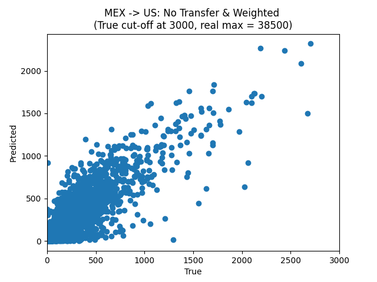
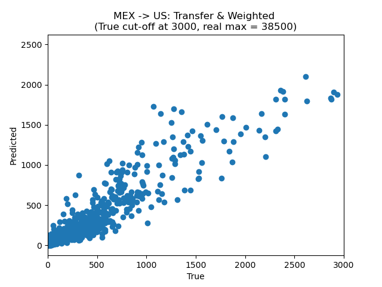
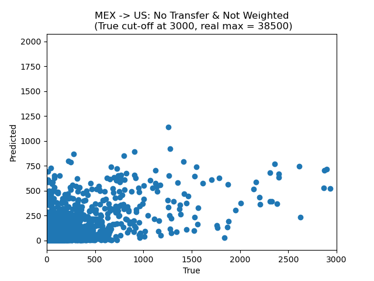
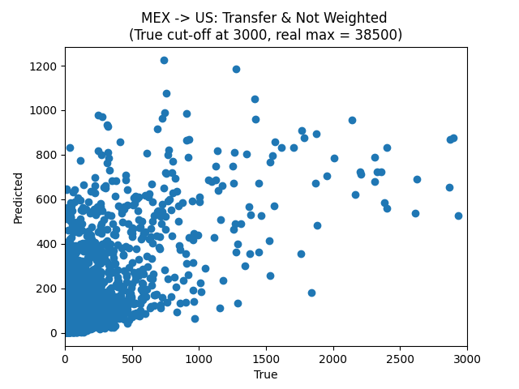

# socialSig-mig

## Current Results

### Weighted & Non-Transfer Learning Models

| Transfer |  Loss Function	|     MAE	  |      r2       |	 Quantity Error	 |  Allocation Error  |
|----------|----------------|-------------|---------------|------------------|--------------------|
|   No	   |     Normal	    | 206.9039011 |	0.1518472024  |	  142023.9463	 |    340269.0472     |
|   No	   |    Weighted	| 137.0349846 |	0.6550720991  |	  48718.29571	 |    319428.5491     |

### Model Plots

<!--  -->

<!--  -->

### Definitions & Weights

**Transfer**  
Yes = Used pre-trained weights from within Mexico model 
No = Used only pre-trained ImageNet weights

**Loss Function**  
Normal = L1 Loss (Sum of absolute errors)  
Weighted = Weighted L1 Loss (Sum of absolute errors multipled by the weight of their class)
		
		
		
		
**Weights**  
*Number of migrants:*  |     Number      |    Weight (1/n)         |
|----------------------|-----------------|-------------------------|
|          0	       |     1/51	     |   0.0196078431372549    |
|       (0, 100)	   |     1/694	     |   0.001440922190201729  |
|      (100, 1000)	   |     1/1481	     |   0.0006752194463200541 |
|     (1000, max)	   |     1/105	     |   0.009523809523809525  |

 
 
 
 
 
 

**Outdated**  

|       Model	    |       MAE	     |          R2	     |  Quantity Error	|  Allocation Error  |
|-------------------|----------------|-------------------|------------------|--------------------|
| Decision Tree	    |              	 |              	 |                  |                    |
| KNN	            |                |              	 |          	    |                    |
| Random Forest	    |              	 |              	 |              	|                    |
| Neural Network	|              	 |              	 |              	|                    |
| socialSigNoDrop	|  3.854131323	 |  0.00007840973309 |    17167.04453	|     59915.58194    |
| socialSign - VB	|          	     |          	     |          	    |                    |

|   Yes	   |     Normal	    | 193.8811298 |	0.1925204041  |	  190282.6378	 |    261654.2757     |
|   Yes	   |    Weighted	| 107.8059514 |	0.4457912232  |	  196465.777	 |    54829.89573     |

